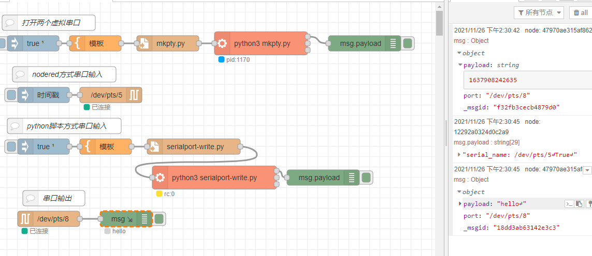

# Node-red[🔗](https://nodered.org/)

Node-RED 是一种事件驱动应用程序的低代码编程工具，用于以新颖有趣的方式将硬件设备、API 和在线服务连接在一起。

## 特点

- 提供了一个**基于浏览器的流编辑器**，可以使用面板中的广泛**节点**(node)轻松将**流**（flow)连接在一起，只需单击即可部署运行。
- 包存储库中有超过 225,000 个**模块**，同时可以在富文本编辑器中创建 **JavaScript 函数**。
- 轻量级运行时**建立在 Node.js 之上**，充分利用了其事件驱动的非阻塞模型。这使其非常适合在 Raspberry Pi 等低成本硬件以及云中运行在网络边缘。

## 快速开始

#### 在本地运行

系统环境：ubuntu

先决条件：Node.js

安装命令(该命令会将 Node-RED 安装为全局模块及其依赖项)

```shell
# ubuntu下使用npm
sudo npm install -g --unsafe-perm node-red
# window
npm install -g --unsafe-perm node-red
# 运行，通过将浏览器指向http://localhost:1880来访问 Node-RED 编辑器。
node-red

# 推荐：使用 docker 安装并运行
docker run -it -p 1880:1880 --name mynodered nodered/node-red
```

#### 在设备上

##### 设备：能源控制器

使用docker方式部署，快捷有效，部署环境和开发环境一致。

##### 设备：树莓派

提供了一个脚本来将 Node.js、npm 和 Node-RED 安装到 Raspberry Pi 上

```shell
bash <(curl -sL https://raw.githubusercontent.com/node-red/linux-installers/master/deb/update-nodejs-and-nodered)

# 由于 Raspberry Pi 的内存有限，使用替代命令并传入 max-old-space-size参数。
node-red-pi --max-old-space-size=256

# 开机自启动
sudo systemctl enable nodered.service
sudo systemctl disable nodered.service
```

如果在树莓派桌面上使用浏览器，可以打开地址：[http://localhost:1880](http://localhost:1880/)。

从另一台机器浏览时，使用 Pi 的主机名或 IP 地址：`http://<hostname>:1880`。通过`hostname -I`找到 IP 地址。

##### 设备：安卓

使用应用商店中的[Termux](https://termux.com/)应用可以轻松地在 Android 设备上运行 Node-RED。

#### 在云端

IBM cloud、AWS、微软 Azure

## 在 Docker 下运行

Node-RED 可以在 Docker 下以多种方式运行，并且支持多种架构（amd64、arm32v6、arm32v7、arm64v8 和 s390x）。

### 基本命令

Node-RED 在[Docker Hub](https://hub.docker.com/r/nodered/node-red/)上的存储库为`nodered/node-red`.

```shell
# 无需知道/指定系统架构，运行以下命令来拉取匹配的镜像，并运行容器。
docker run -it -p 1880:1880 -v node_red_data:/data --name mynodered nodered/node-red:latest （大小500MB）
# 指定标签
docker run -it -p 1880:1880 -v node_red_data:/data --name mynodered nodered/node-red:1.3.5-12-arm32v7 （大小150MB）
docker run -it -p 1880:1880 -v node_red_data:/data --name mynodered nodered/node-red:1.3.5-12-minimal-arm32v7（最小版本不包含构建工具或对项目的支持。大小60MB）

# 其他涉及命令与docker一致
docker attach mynodered
docker start mynodered
docker stop mynodered
docker exec -it mynodered /bin/bash

## 用户数据管理
# 使用主机目录进行持久化（绑定挂载）
docker run -it -p 1880:1880 -v /home/.node-red:/data --name mynodered nodered/node-red
# 使用命名数据卷（可以销毁容器并启动一个新实例，而不会丢失用户数据）
docker volume create --name node_red_data
docker volume ls
# 在容器运行时从挂载的卷中备份数据
docker cp  mynodered:/data  /your/backup/directory

# 更新容器
docker pull nodered/node-red
docker stop mynodered
docker rm mynodered
docker run -it -p 1880:1880 -v node_red_data:/data --name mynodered nodered/node-red
```

### 链接容器

使用 Docker桥接网络在“内部”链接其他容器。

```shell
# 创建一个名为iot的新网桥
docker network create iot
# 所有需要通信的容器都需要使用–network命令行选项添加到同一个网桥
docker run -itd --network iot --name mybroker eclipse-mosquitto mosquitto -c /mosquitto-no-auth.conf （Eclipse Mosquitto 是一个开源MQTT代理）
docker run -itd -p 1880:1880 -v node_red_data:/data --network iot --name mynodered nodered/node-red （使用主机名mybroker从 Node-RED 应用程序访问代理）
```

简单流程：显示连接到代理的 mqtt 节点

```JSON
    [{"id":"c51cbf73.d90738","type":"mqtt in","z":"3fa278ec.8cbaf","name":"","topic":"test","broker":"5673f1d5.dd5f1","x":290,"y":240,"wires":[["7781c73.639b8b8"]]},{"id":"7008d6ef.b6ee38","type":"mqtt out","z":"3fa278ec.8cbaf","name":"","topic":"test","qos":"","retain":"","broker":"5673f1d5.dd5f1","x":517,"y":131,"wires":[]},{"id":"ef5b970c.7c864","type":"inject","z":"3fa278ec.8cbaf","name":"","repeat":"","crontab":"","once":false,"topic":"","payload":"","payloadType":"date","x":290,"y":153,"wires":[["7008d6ef.b6ee38"]]},{"id":"7781c73.639b8b8","type":"debug","z":"3fa278ec.8cbaf","name":"","active":true,"tosidebar":true,"console":false,"tostatus":true,"complete":"payload","targetType":"msg","statusVal":"payload","statusType":"auto","x":505,"y":257,"wires":[]},{"id":"5673f1d5.dd5f1","type":"mqtt-broker","z":"","name":"","broker":"mybroker","port":"1883","clientid":"","usetls":false,"compatmode":false,"keepalive":"15","cleansession":true,"birthTopic":"","birthQos":"0","birthRetain":"false","birthPayload":"","closeTopic":"","closeRetain":"false","closePayload":"","willTopic":"","willQos":"0","willRetain":"false","willPayload":""}]
```

### 访问设备

要访问主机串行端口，需要将容器添加到`dialout`组中

```shell
docker run -it -p 1880:1880 -v node_red_data:/data --group-add dialout --name mynodered nodered/node-red
```

从容器内的主机访问设备，例如串行端口，使用 `--device` 来传递访问权限。

```shell
docker run -it -p 1880:1880 -v node_red_data:/data --name mynodered --device=/dev/ttyACM0 nodered/node-red
```

## Node-RED 开发手册

## flow示例

### Shell


```json
[
    {
        "id": "de8f29bbb9aab3e6",
        "type": "tab",
        "label": "Shell",
        "disabled": false,
        "info": "",
        "env": []
    },
    {
        "id": "8453d33f97379298",
        "type": "exec",
        "z": "de8f29bbb9aab3e6",
        "command": "pwd",
        "addpay": "",
        "append": "",
        "useSpawn": "false",
        "timer": "",
        "winHide": false,
        "oldrc": false,
        "name": "",
        "x": 310,
        "y": 120,
        "wires": [
            [
                "3627de9d03f0f8d5"
            ],
            [],
            []
        ]
    },
    {
        "id": "3627de9d03f0f8d5",
        "type": "debug",
        "z": "de8f29bbb9aab3e6",
        "name": "",
        "active": true,
        "tosidebar": true,
        "console": false,
        "tostatus": true,
        "complete": "payload",
        "targetType": "msg",
        "statusVal": "payload",
        "statusType": "auto",
        "x": 510,
        "y": 120,
        "wires": []
    },
    {
        "id": "7e7f3063aee5bf37",
        "type": "inject",
        "z": "de8f29bbb9aab3e6",
        "name": "",
        "props": [
            {
                "p": "topic",
                "vt": "str"
            }
        ],
        "repeat": "",
        "crontab": "",
        "once": false,
        "onceDelay": 0.1,
        "topic": "",
        "x": 170,
        "y": 120,
        "wires": [
            [
                "8453d33f97379298"
            ]
        ]
    },
    {
        "id": "ec8df97e20078874",
        "type": "inject",
        "z": "de8f29bbb9aab3e6",
        "name": "Force",
        "props": [
            {
                "p": "payload"
            },
            {
                "p": "topic",
                "vt": "str"
            }
        ],
        "repeat": "",
        "crontab": "",
        "once": false,
        "onceDelay": "",
        "topic": "",
        "payloadType": "date",
        "x": 130,
        "y": 280,
        "wires": [
            [
                "85badd126c83efd8"
            ]
        ]
    },
    {
        "id": "4149966e30037ead",
        "type": "debug",
        "z": "de8f29bbb9aab3e6",
        "name": "output",
        "active": true,
        "tosidebar": true,
        "console": false,
        "tostatus": true,
        "complete": "true",
        "targetType": "full",
        "statusVal": "payload",
        "statusType": "auto",
        "x": 550,
        "y": 220,
        "wires": []
    },
    {
        "id": "5982ca0b8799f34c",
        "type": "function",
        "z": "de8f29bbb9aab3e6",
        "name": "timeConvert",
        "func": "if ( !msg.timestamp ) msg.timestamp = Math.round(+new Date());\n\nvar dt = new Date(msg.timestamp);\nvar msg = {\n\t'month':\tdt.getMonth() + 1,\n\t'day':\t\tdt.getDate(),\n\t'year':\t\tdt.getFullYear(),\n\t'hours':\tdt.getHours(),\n\t'mins':\t\tdt.getMinutes(),\n\t'msecs':\tdt.getMilliseconds()\n}\n\nreturn msg;",
        "outputs": 1,
        "noerr": 0,
        "initialize": "",
        "finalize": "",
        "libs": [],
        "x": 370,
        "y": 200,
        "wires": [
            [
                "4149966e30037ead"
            ]
        ]
    },
    {
        "id": "85badd126c83efd8",
        "type": "function",
        "z": "de8f29bbb9aab3e6",
        "name": "set timestamp",
        "func": "msg.timestamp=1376763133 * 1000;\nreturn msg;",
        "outputs": 1,
        "noerr": 0,
        "initialize": "",
        "finalize": "",
        "libs": [],
        "x": 360,
        "y": 280,
        "wires": [
            [
                "5982ca0b8799f34c"
            ]
        ]
    },
    {
        "id": "9195054339f827f6",
        "type": "inject",
        "z": "de8f29bbb9aab3e6",
        "name": "时间戳",
        "props": [
            {
                "p": "payload"
            },
            {
                "p": "topic",
                "vt": "str"
            }
        ],
        "repeat": "",
        "crontab": "",
        "once": false,
        "onceDelay": "",
        "topic": "",
        "payloadType": "date",
        "x": 130,
        "y": 200,
        "wires": [
            [
                "5982ca0b8799f34c"
            ]
        ]
    }
]
```

### mqtt


```json
[
    {
        "id": "f6f2187d.f17ca8",
        "type": "tab",
        "label": "mqtt-flow",
        "disabled": false,
        "info": "",
        "env": []
    },
    {
        "id": "c51cbf73.d90738",
        "type": "mqtt in",
        "z": "f6f2187d.f17ca8",
        "name": "",
        "topic": "mybroker",
        "qos": "2",
        "datatype": "json",
        "broker": "5d077b9fbd5a461e",
        "nl": false,
        "rap": false,
        "inputs": 0,
        "x": 140,
        "y": 220,
        "wires": [
            [
                "e8d7267d387f9d97"
            ]
        ]
    },
    {
        "id": "7008d6ef.b6ee38",
        "type": "mqtt out",
        "z": "f6f2187d.f17ca8",
        "name": "",
        "topic": "mybroker",
        "qos": "",
        "retain": "",
        "respTopic": "",
        "contentType": "",
        "userProps": "",
        "correl": "",
        "expiry": "",
        "broker": "5d077b9fbd5a461e",
        "x": 340,
        "y": 140,
        "wires": []
    },
    {
        "id": "ef5b970c.7c864",
        "type": "inject",
        "z": "f6f2187d.f17ca8",
        "name": "",
        "props": [
            {
                "p": "payload"
            },
            {
                "p": "topic",
                "vt": "str"
            }
        ],
        "repeat": "",
        "crontab": "",
        "once": false,
        "onceDelay": "",
        "topic": "",
        "payloadType": "date",
        "x": 170,
        "y": 140,
        "wires": [
            [
                "7008d6ef.b6ee38",
                "a70b6f6afab0bdf3"
            ]
        ]
    },
    {
        "id": "7781c73.639b8b8",
        "type": "debug",
        "z": "f6f2187d.f17ca8",
        "name": "",
        "active": true,
        "tosidebar": true,
        "console": false,
        "tostatus": true,
        "complete": "payload",
        "targetType": "msg",
        "statusVal": "payload",
        "statusType": "auto",
        "x": 530,
        "y": 220,
        "wires": []
    },
    {
        "id": "a70b6f6afab0bdf3",
        "type": "debug",
        "z": "f6f2187d.f17ca8",
        "name": "",
        "active": true,
        "tosidebar": true,
        "console": false,
        "tostatus": true,
        "complete": "payload",
        "targetType": "msg",
        "statusVal": "payload",
        "statusType": "auto",
        "x": 330,
        "y": 80,
        "wires": []
    },
    {
        "id": "e8d7267d387f9d97",
        "type": "function",
        "z": "f6f2187d.f17ca8",
        "name": "Format timestamp",
        "func": "// Create a Date object from the payload\nvar date = new Date(msg.payload);\n// Change the payload to be a formatted Date string\nmsg.payload = date.toString();\n// Return the message so it can be sent on\nreturn msg;",
        "outputs": 1,
        "noerr": 0,
        "initialize": "",
        "finalize": "",
        "libs": [],
        "x": 330,
        "y": 220,
        "wires": [
            [
                "7781c73.639b8b8"
            ]
        ]
    },
    {
        "id": "5d077b9fbd5a461e",
        "type": "mqtt-broker",
        "name": "",
        "broker": "127.0.0.1",
        "port": "1883",
        "clientid": "",
        "autoConnect": true,
        "usetls": false,
        "protocolVersion": "4",
        "keepalive": "60",
        "cleansession": true,
        "birthTopic": "",
        "birthQos": "0",
        "birthPayload": "",
        "birthMsg": {},
        "closeTopic": "",
        "closeQos": "0",
        "closePayload": "",
        "closeMsg": {},
        "willTopic": "",
        "willQos": "0",
        "willPayload": "",
        "willMsg": {},
        "sessionExpiry": ""
    }
]
```


### http


```json
[
    {
        "id": "aa89849c33295c85",
        "type": "tab",
        "label": "http-flow",
        "disabled": false,
        "info": "",
        "env": []
    },
    {
        "id": "3b4b47a5.77a928",
        "type": "inject",
        "z": "aa89849c33295c85",
        "name": "inject",
        "props": [
            {
                "p": "payload"
            },
            {
                "p": "topic",
                "vt": "str"
            }
        ],
        "repeat": "",
        "crontab": "",
        "once": true,
        "onceDelay": "",
        "topic": "",
        "payloadType": "date",
        "x": 150,
        "y": 120,
        "wires": [
            [
                "dbc66e1b.fef19"
            ]
        ]
    },
    {
        "id": "dbc66e1b.fef19",
        "type": "function",
        "z": "aa89849c33295c85",
        "name": "getJoke",
        "func": "const getJoke = function (firstname=\"Chuck\", lastname=\"Norris\") {\n    \n    let promise = new Promise((resolve, reject) => {\n        msg.resolve = resolve;\n        msg.reject = reject;\n    });\n    \n    msg.url = `http://api.icndb.com/jokes/random?firstName=${firstname}&lastName=${lastname}`;\n    msg.method = 'GET';\n    \n    node.send(Object.assign({}, msg));\n    \n    return promise;\n};\n\nglobal.set('getJoke', getJoke);",
        "outputs": 1,
        "noerr": 0,
        "initialize": "",
        "finalize": "",
        "libs": [],
        "x": 280,
        "y": 120,
        "wires": [
            [
                "7995241c.8025dc"
            ]
        ]
    },
    {
        "id": "7995241c.8025dc",
        "type": "http request",
        "z": "aa89849c33295c85",
        "name": "",
        "method": "use",
        "ret": "obj",
        "paytoqs": "ignore",
        "url": "",
        "tls": "",
        "persist": false,
        "proxy": "",
        "authType": "",
        "senderr": false,
        "x": 430,
        "y": 120,
        "wires": [
            [
                "d502bf3.123474"
            ]
        ]
    },
    {
        "id": "a71e60af.8cb3a",
        "type": "function",
        "z": "aa89849c33295c85",
        "name": "getJoke()",
        "func": "const joke = global.get('getJoke')();\n\njoke.then(joke => {\n    node.warn(joke);\n}).catch(error => {\n    node.error(error);\n});",
        "outputs": "0",
        "noerr": 0,
        "initialize": "",
        "finalize": "",
        "libs": [],
        "x": 280,
        "y": 220,
        "wires": []
    },
    {
        "id": "d99782c4.32a13",
        "type": "inject",
        "z": "aa89849c33295c85",
        "name": "run",
        "props": [
            {
                "p": "payload"
            },
            {
                "p": "topic",
                "vt": "str"
            }
        ],
        "repeat": "",
        "crontab": "",
        "once": false,
        "onceDelay": "",
        "topic": "",
        "payloadType": "date",
        "x": 150,
        "y": 220,
        "wires": [
            [
                "a71e60af.8cb3a"
            ]
        ]
    },
    {
        "id": "d502bf3.123474",
        "type": "function",
        "z": "aa89849c33295c85",
        "name": "resolve",
        "func": "msg.resolve(msg.payload.value.joke);\n\n// reject\n// setTimeout(function () {\n//     msg.reject({message: 'Could not request joke'});\n// }, 2000);",
        "outputs": "0",
        "noerr": 0,
        "initialize": "",
        "finalize": "",
        "libs": [],
        "x": 580,
        "y": 120,
        "wires": []
    },
    {
        "id": "6cb62d4c.1bf0e4",
        "type": "comment",
        "z": "aa89849c33295c85",
        "name": "use above flow",
        "info": "",
        "x": 160,
        "y": 180,
        "wires": []
    },
    {
        "id": "b948f89704b7460e",
        "type": "debug",
        "z": "aa89849c33295c85",
        "name": "",
        "active": true,
        "tosidebar": true,
        "console": false,
        "tostatus": false,
        "complete": "false",
        "statusVal": "",
        "statusType": "auto",
        "x": 450,
        "y": 220,
        "wires": []
    }
]
```


### websockets


```json
[
    {
        "id": "5a5ee5b0518e6201",
        "type": "tab",
        "label": "websockets-flow",
        "disabled": false,
        "info": "",
        "env": []
    },
    {
        "id": "b8edce4.ccd31b",
        "type": "websocket in",
        "z": "5a5ee5b0518e6201",
        "name": "",
        "server": "9cb2406a.8026b",
        "client": "",
        "x": 180,
        "y": 300,
        "wires": [
            [
                "dcfc3e96.f1e1b8"
            ]
        ]
    },
    {
        "id": "42c48f04.f2198",
        "type": "websocket out",
        "z": "5a5ee5b0518e6201",
        "name": "",
        "server": "9cb2406a.8026b",
        "client": "",
        "x": 600,
        "y": 300,
        "wires": []
    },
    {
        "id": "bb8e83fc.b8afe",
        "type": "change",
        "z": "5a5ee5b0518e6201",
        "name": "result",
        "rules": [
            {
                "t": "set",
                "p": "payload",
                "pt": "msg",
                "to": "{\t    \"jsonrpc\": \"2.0\",\t    \"result\": {\t        \"ack\": $millis()\t    },\t    \"id\": payload.id\t}",
                "tot": "jsonata"
            }
        ],
        "action": "",
        "property": "",
        "from": "",
        "to": "",
        "reg": false,
        "x": 450,
        "y": 300,
        "wires": [
            [
                "42c48f04.f2198"
            ]
        ]
    },
    {
        "id": "9736c3b8.651ad",
        "type": "websocket out",
        "z": "5a5ee5b0518e6201",
        "name": "",
        "server": "",
        "client": "3a960f68.dfb54",
        "x": 400,
        "y": 120,
        "wires": []
    },
    {
        "id": "ec2054f9.08769",
        "type": "inject",
        "z": "5a5ee5b0518e6201",
        "name": "",
        "props": [
            {
                "p": "payload"
            },
            {
                "p": "topic",
                "vt": "str"
            }
        ],
        "repeat": "",
        "crontab": "",
        "once": false,
        "onceDelay": 0.1,
        "topic": "",
        "payload": "{\"jsonrpc\":\"2.0\",\"method\":\"playerTap\",\"params\":{\"playerId\":\"2323232323\"},\"id\":1}",
        "payloadType": "json",
        "x": 170,
        "y": 120,
        "wires": [
            [
                "9736c3b8.651ad"
            ]
        ]
    },
    {
        "id": "a2000ce8.ec378",
        "type": "websocket in",
        "z": "5a5ee5b0518e6201",
        "name": "",
        "server": "",
        "client": "3a960f68.dfb54",
        "x": 240,
        "y": 180,
        "wires": [
            [
                "cb80b54b.3468c"
            ]
        ]
    },
    {
        "id": "33d59caf.687ccc",
        "type": "debug",
        "z": "5a5ee5b0518e6201",
        "name": "",
        "active": true,
        "tosidebar": true,
        "console": false,
        "tostatus": false,
        "complete": "false",
        "x": 590,
        "y": 180,
        "wires": []
    },
    {
        "id": "569c2eb9.8c11c",
        "type": "comment",
        "z": "5a5ee5b0518e6201",
        "name": "Server",
        "info": "",
        "x": 150,
        "y": 240,
        "wires": []
    },
    {
        "id": "6eea9aec.9e331c",
        "type": "comment",
        "z": "5a5ee5b0518e6201",
        "name": "Client",
        "info": "",
        "x": 150,
        "y": 80,
        "wires": []
    },
    {
        "id": "cb80b54b.3468c",
        "type": "json",
        "z": "5a5ee5b0518e6201",
        "name": "",
        "property": "payload",
        "action": "",
        "pretty": false,
        "x": 450,
        "y": 180,
        "wires": [
            [
                "33d59caf.687ccc"
            ]
        ]
    },
    {
        "id": "dcfc3e96.f1e1b8",
        "type": "json",
        "z": "5a5ee5b0518e6201",
        "name": "",
        "property": "payload",
        "action": "obj",
        "pretty": false,
        "x": 330,
        "y": 300,
        "wires": [
            [
                "bb8e83fc.b8afe"
            ]
        ]
    },
    {
        "id": "9cb2406a.8026b",
        "type": "websocket-listener",
        "path": "/ws/request",
        "wholemsg": "false"
    },
    {
        "id": "3a960f68.dfb54",
        "type": "websocket-client",
        "path": "ws://localhost:1880/ws/request",
        "tls": "",
        "wholemsg": "false"
    }
]
```


### csv文件解析


```json
[
    {
        "id": "11af5138f3d9fea8",
        "type": "tab",
        "label": "csv-flow",
        "disabled": false,
        "info": "",
        "env": []
    },
    {
        "id": "d92c65a4.566478",
        "type": "inject",
        "z": "11af5138f3d9fea8",
        "name": "Init",
        "props": [
            {
                "p": "payload"
            },
            {
                "p": "topic",
                "vt": "str"
            }
        ],
        "repeat": "",
        "crontab": "",
        "once": false,
        "onceDelay": 0.1,
        "topic": "",
        "payloadType": "date",
        "x": 110,
        "y": 100,
        "wires": [
            [
                "4e4829e3.eaeae8"
            ]
        ]
    },
    {
        "id": "4e4829e3.eaeae8",
        "type": "file in",
        "z": "11af5138f3d9fea8",
        "name": "",
        "filename": "tableau.csv",
        "format": "utf8",
        "chunk": false,
        "sendError": false,
        "encoding": "utf8",
        "allProps": false,
        "x": 250,
        "y": 100,
        "wires": [
            [
                "d42eaa86.c12c18",
                "ac4d4a6fc6b7c5e5"
            ]
        ]
    },
    {
        "id": "d42eaa86.c12c18",
        "type": "csv",
        "z": "11af5138f3d9fea8",
        "name": "",
        "sep": ",",
        "hdrin": true,
        "hdrout": "none",
        "multi": "mult",
        "ret": "\\n",
        "temp": "",
        "skip": "0",
        "strings": true,
        "include_empty_strings": "",
        "include_null_values": false,
        "x": 470,
        "y": 100,
        "wires": [
            [
                "3ac5b1c2.cbbd5e"
            ]
        ]
    },
    {
        "id": "3ac5b1c2.cbbd5e",
        "type": "split",
        "z": "11af5138f3d9fea8",
        "name": "",
        "splt": ";",
        "spltType": "str",
        "arraySplt": 1,
        "arraySpltType": "len",
        "stream": true,
        "addname": "topic",
        "x": 610,
        "y": 100,
        "wires": [
            [
                "5ed3ced8.9dd17"
            ]
        ]
    },
    {
        "id": "5ed3ced8.9dd17",
        "type": "switch",
        "z": "11af5138f3d9fea8",
        "name": "",
        "property": "payload.name",
        "propertyType": "msg",
        "rules": [
            {
                "t": "eq",
                "v": "led1",
                "vt": "str"
            },
            {
                "t": "eq",
                "v": "led2",
                "vt": "str"
            },
            {
                "t": "eq",
                "v": "led3",
                "vt": "str"
            }
        ],
        "checkall": "true",
        "repair": false,
        "outputs": 3,
        "x": 150,
        "y": 180,
        "wires": [
            [
                "1fbafc85.1bae13"
            ],
            [
                "eb8c629c.fac47"
            ],
            [
                "81cb2400.d5dea8"
            ]
        ]
    },
    {
        "id": "1fbafc85.1bae13",
        "type": "function",
        "z": "11af5138f3d9fea8",
        "name": "led1",
        "func": "msg.name = msg.payload.name;\nmsg.color = msg.payload.color;\n\nreturn msg;",
        "outputs": 1,
        "noerr": 0,
        "initialize": "",
        "finalize": "",
        "libs": [],
        "x": 330,
        "y": 180,
        "wires": [
            [
                "a514228b.20c53"
            ]
        ]
    },
    {
        "id": "eb8c629c.fac47",
        "type": "function",
        "z": "11af5138f3d9fea8",
        "name": "led2",
        "func": "msg.name = msg.payload.name;\nmsg.color = msg.payload.color;\n\nreturn msg;",
        "outputs": 1,
        "noerr": 0,
        "initialize": "",
        "finalize": "",
        "libs": [],
        "x": 330,
        "y": 220,
        "wires": [
            []
        ]
    },
    {
        "id": "81cb2400.d5dea8",
        "type": "function",
        "z": "11af5138f3d9fea8",
        "name": "led3",
        "func": "msg.name = msg.payload.name;\nmsg.color = msg.payload.color;\n\nreturn msg;",
        "outputs": 1,
        "noerr": 0,
        "initialize": "",
        "finalize": "",
        "libs": [],
        "x": 330,
        "y": 260,
        "wires": [
            []
        ]
    },
    {
        "id": "a514228b.20c53",
        "type": "debug",
        "z": "11af5138f3d9fea8",
        "name": "",
        "active": true,
        "tosidebar": true,
        "console": false,
        "tostatus": false,
        "complete": "false",
        "statusVal": "",
        "statusType": "auto",
        "x": 490,
        "y": 180,
        "wires": []
    },
    {
        "id": "ac4d4a6fc6b7c5e5",
        "type": "debug",
        "z": "11af5138f3d9fea8",
        "name": "",
        "active": true,
        "tosidebar": true,
        "console": false,
        "tostatus": false,
        "complete": "false",
        "statusVal": "",
        "statusType": "auto",
        "x": 490,
        "y": 60,
        "wires": []
    }
]
```


### python脚本


```json
[
    {
        "id": "d7276cd2.d6f55",
        "type": "tab",
        "label": "pythontest",
        "disabled": false,
        "info": ""
    },
    {
        "id": "a7d4e707.fd8a18",
        "type": "inject",
        "z": "d7276cd2.d6f55",
        "name": "",
        "props": [
            {
                "p": "payload"
            },
            {
                "p": "topic",
                "vt": "str"
            }
        ],
        "repeat": "",
        "crontab": "",
        "once": false,
        "onceDelay": 0.1,
        "topic": "",
        "payloadType": "date",
        "x": 230,
        "y": 80,
        "wires": [
            [
                "97c92fce.dd6f6"
            ]
        ]
    },
    {
        "id": "97c92fce.dd6f6",
        "type": "template",
        "z": "d7276cd2.d6f55",
        "name": "",
        "field": "payload",
        "fieldType": "msg",
        "format": "python",
        "syntax": "plain",
        "template": "import time\nprint(time.ctime())\n",
        "output": "str",
        "x": 370,
        "y": 80,
        "wires": [
            [
                "1273e63.74b5c1a"
            ]
        ]
    },
    {
        "id": "1273e63.74b5c1a",
        "type": "file",
        "z": "d7276cd2.d6f55",
        "name": "",
        "filename": "pythontest.py",
        "appendNewline": false,
        "createDir": true,
        "overwriteFile": "true",
        "encoding": "none",
        "x": 510,
        "y": 80,
        "wires": [
            [
                "14057906.c24237"
            ]
        ]
    },
    {
        "id": "14057906.c24237",
        "type": "exec",
        "z": "d7276cd2.d6f55",
        "command": "python3 pythontest.py",
        "addpay": false,
        "append": "",
        "useSpawn": "false",
        "timer": "",
        "winHide": false,
        "oldrc": false,
        "name": "",
        "x": 300,
        "y": 160,
        "wires": [
            [
                "a33c536c.9900e"
            ],
            [],
            []
        ]
    },
    {
        "id": "a33c536c.9900e",
        "type": "debug",
        "z": "d7276cd2.d6f55",
        "name": "",
        "active": true,
        "tosidebar": true,
        "console": false,
        "tostatus": true,
        "complete": "payload",
        "targetType": "msg",
        "statusVal": "payload",
        "statusType": "auto",
        "x": 550,
        "y": 160,
        "wires": []
    }
]
```

### serialport串口通信

从设置—节点管理—安装—搜索“serial port”，node-red现有3578 个可用模块。

使用python脚本创建两个虚拟串口进行测试，以下方式均无问题。

| node-red内串口通信        | √    |
| ------------------------- | ---- |
| 外部输入-node-red串口接收 | √    |
| nodered串口输入-外部接收  | √    |
| node-red串口请求          | √    |



```json
[
    {
        "id": "d4e7536169036f5e",
        "type": "tab",
        "label": "流程 1",
        "disabled": false,
        "info": "",
        "env": []
    },
    {
        "id": "a75884e7781f69a3",
        "type": "template",
        "z": "d4e7536169036f5e",
        "name": "",
        "field": "payload",
        "fieldType": "msg",
        "format": "python",
        "syntax": "plain",
        "template": "#! /usr/bin/env python\n#coding=utf-8\nimport pty\nimport os\nimport select\n\ndef mkpty():\n    master1, slave = pty.openpty()\n    slaveName1 = os.ttyname(slave)\n    master2, slave = pty.openpty()\n    slaveName2 = os.ttyname(slave)\n    print('\\nslave device names: ', slaveName1, slaveName2)\n    return master1, master2\n\nif __name__ == \"__main__\":\n\n    master1, master2 = mkpty()\n    print(master1, master2)\n    while True:\n        rl, wl, el = select.select([master1,master2], [], [], 1)\n        for master in rl:\n            print(master)\n            data = os.read(master, 128)\n            if master==master1:\n                os.write(master2, data)\n            else:\n                os.write(master1, data)",
        "output": "str",
        "x": 190,
        "y": 80,
        "wires": [
            [
                "a568e850369066ec"
            ]
        ]
    },
    {
        "id": "a568e850369066ec",
        "type": "file",
        "z": "d4e7536169036f5e",
        "name": "",
        "filename": "mkpty.py",
        "appendNewline": false,
        "createDir": true,
        "overwriteFile": "true",
        "encoding": "none",
        "x": 330,
        "y": 80,
        "wires": [
            [
                "2465733dd6dcaf50"
            ]
        ]
    },
    {
        "id": "2465733dd6dcaf50",
        "type": "exec",
        "z": "d4e7536169036f5e",
        "command": "python3 mkpty.py",
        "addpay": "payload",
        "append": "",
        "useSpawn": "true",
        "timer": "",
        "winHide": false,
        "oldrc": false,
        "name": "",
        "x": 510,
        "y": 80,
        "wires": [
            [
                "232de470a31d5476"
            ],
            [],
            []
        ]
    },
    {
        "id": "232de470a31d5476",
        "type": "debug",
        "z": "d4e7536169036f5e",
        "name": "",
        "active": true,
        "tosidebar": true,
        "console": false,
        "tostatus": false,
        "complete": "payload",
        "targetType": "msg",
        "statusVal": "",
        "statusType": "auto",
        "x": 710,
        "y": 80,
        "wires": []
    },
    {
        "id": "40facbe1f3ee1505",
        "type": "serial out",
        "z": "d4e7536169036f5e",
        "name": "",
        "serial": "afaa8a6b0dd50b95",
        "x": 220,
        "y": 180,
        "wires": []
    },
    {
        "id": "a4f0119da97efe0b",
        "type": "inject",
        "z": "d4e7536169036f5e",
        "name": "",
        "props": [
            {
                "p": "payload"
            },
            {
                "p": "topic",
                "vt": "str"
            }
        ],
        "repeat": "",
        "crontab": "",
        "once": false,
        "onceDelay": 0.1,
        "topic": "",
        "payloadType": "date",
        "x": 90,
        "y": 180,
        "wires": [
            [
                "40facbe1f3ee1505"
            ]
        ]
    },
    {
        "id": "397949e4036d6c56",
        "type": "inject",
        "z": "d4e7536169036f5e",
        "name": "",
        "props": [
            {
                "p": "payload"
            }
        ],
        "repeat": "",
        "crontab": "",
        "once": true,
        "onceDelay": "0",
        "topic": "",
        "payload": "true",
        "payloadType": "bool",
        "x": 70,
        "y": 80,
        "wires": [
            [
                "a75884e7781f69a3"
            ]
        ]
    },
    {
        "id": "59749978e24ce322",
        "type": "serial in",
        "z": "d4e7536169036f5e",
        "name": "",
        "serial": "72d1d77d5579d876",
        "x": 100,
        "y": 420,
        "wires": [
            [
                "47970ae315af862f"
            ]
        ]
    },
    {
        "id": "47970ae315af862f",
        "type": "debug",
        "z": "d4e7536169036f5e",
        "name": "",
        "active": true,
        "tosidebar": true,
        "console": true,
        "tostatus": true,
        "complete": "true",
        "targetType": "full",
        "statusVal": "payload",
        "statusType": "auto",
        "x": 250,
        "y": 420,
        "wires": []
    },
    {
        "id": "e724021c7e62baec",
        "type": "inject",
        "z": "d4e7536169036f5e",
        "name": "",
        "props": [
            {
                "p": "payload"
            }
        ],
        "repeat": "",
        "crontab": "",
        "once": true,
        "onceDelay": "0",
        "topic": "",
        "payload": "true",
        "payloadType": "bool",
        "x": 90,
        "y": 280,
        "wires": [
            [
                "66eb223287f207ff"
            ]
        ]
    },
    {
        "id": "66eb223287f207ff",
        "type": "template",
        "z": "d4e7536169036f5e",
        "name": "",
        "field": "payload",
        "fieldType": "msg",
        "format": "python",
        "syntax": "plain",
        "template": "#usr/bin/python3\n# -*- coding: utf-8 -*-\n\nimport serial\nser=serial.Serial(\"/dev/pts/5\",115200,timeout=0.5)\n\nprint(\"serial_name:\",ser.name)\nser.close()\nser.open()\nprint(ser.isOpen())\n\n# while True:\n\nser.write(b\"hello\\n\") # 二进制 \n\nser.close()#关闭端口\n",
        "output": "str",
        "x": 210,
        "y": 280,
        "wires": [
            [
                "8d8407b1a9f0ac71"
            ]
        ]
    },
    {
        "id": "8d8407b1a9f0ac71",
        "type": "file",
        "z": "d4e7536169036f5e",
        "name": "",
        "filename": "serialport-write.py",
        "appendNewline": false,
        "createDir": true,
        "overwriteFile": "true",
        "encoding": "none",
        "x": 380,
        "y": 280,
        "wires": [
            [
                "51a7d68829fbc80b"
            ]
        ]
    },
    {
        "id": "51a7d68829fbc80b",
        "type": "exec",
        "z": "d4e7536169036f5e",
        "command": "python3 serialport-write.py",
        "addpay": "payload",
        "append": "",
        "useSpawn": "true",
        "timer": "",
        "winHide": false,
        "oldrc": false,
        "name": "",
        "x": 420,
        "y": 340,
        "wires": [
            [
                "12292a0324d0c2a9"
            ],
            [],
            []
        ]
    },
    {
        "id": "12292a0324d0c2a9",
        "type": "debug",
        "z": "d4e7536169036f5e",
        "name": "",
        "active": true,
        "tosidebar": true,
        "console": false,
        "tostatus": false,
        "complete": "payload",
        "targetType": "msg",
        "statusVal": "",
        "statusType": "auto",
        "x": 630,
        "y": 340,
        "wires": []
    },
    {
        "id": "da2f7e68e80f0916",
        "type": "comment",
        "z": "d4e7536169036f5e",
        "name": "打开两个虚拟串口",
        "info": "",
        "x": 100,
        "y": 40,
        "wires": []
    },
    {
        "id": "3abcdfcc9c78750f",
        "type": "comment",
        "z": "d4e7536169036f5e",
        "name": "python脚本方式串口输入",
        "info": "",
        "x": 130,
        "y": 240,
        "wires": []
    },
    {
        "id": "5160f38632e4a833",
        "type": "comment",
        "z": "d4e7536169036f5e",
        "name": "nodered方式串口输入",
        "info": "",
        "x": 130,
        "y": 140,
        "wires": []
    },
    {
        "id": "e3dfaedff0639e84",
        "type": "comment",
        "z": "d4e7536169036f5e",
        "name": "串口输出",
        "info": "",
        "x": 110,
        "y": 380,
        "wires": []
    },
    {
        "id": "afaa8a6b0dd50b95",
        "type": "serial-port",
        "serialport": "/dev/pts/5",
        "serialbaud": "115200",
        "databits": "8",
        "parity": "none",
        "stopbits": "1",
        "waitfor": "",
        "dtr": "none",
        "rts": "none",
        "cts": "none",
        "dsr": "none",
        "newline": "\\n",
        "bin": "false",
        "out": "char",
        "addchar": "\\n",
        "responsetimeout": "10000"
    },
    {
        "id": "72d1d77d5579d876",
        "type": "serial-port",
        "serialport": "/dev/pts/8",
        "serialbaud": "115200",
        "databits": "8",
        "parity": "none",
        "stopbits": "1",
        "waitfor": "",
        "dtr": "none",
        "rts": "none",
        "cts": "none",
        "dsr": "none",
        "newline": "\\n",
        "bin": "false",
        "out": "char",
        "addchar": "",
        "responsetimeout": "10000"
    }
]
```


## 下一步

- [了解如何保护您的编辑器](https://nodered.org/docs/user-guide/runtime/securing-node-red)：如何保护 Node-RED

