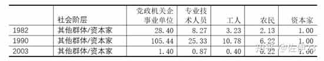
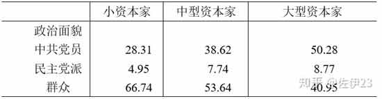
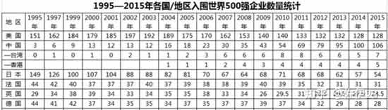
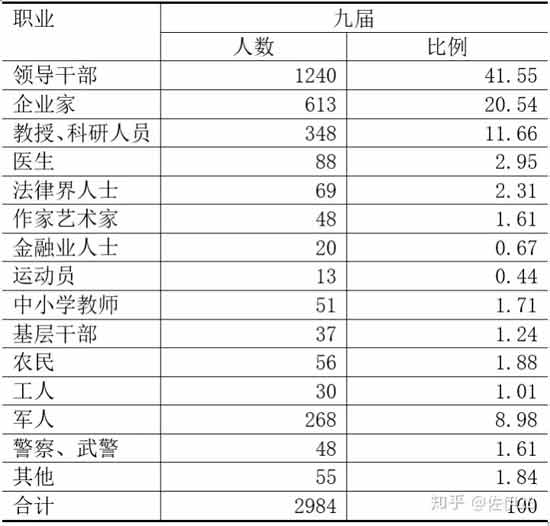
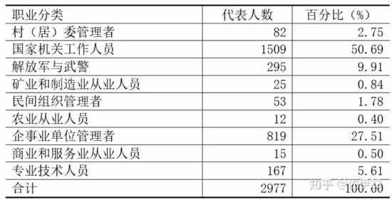
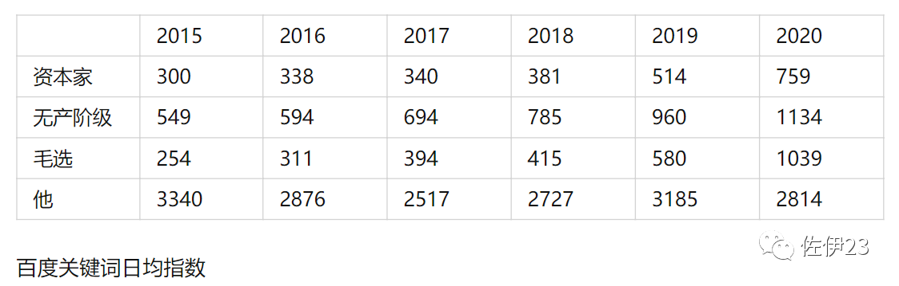
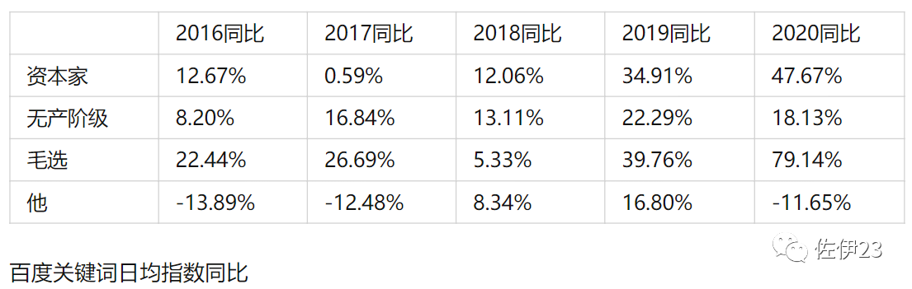
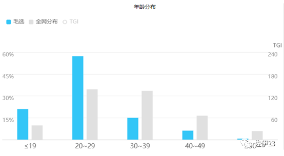
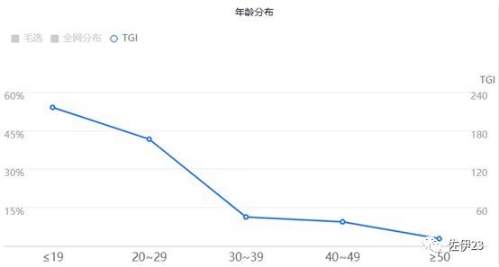

# 资本的复兴和脑力无产者的左转(backup)  

> ***by 佐伊23***

　　2020年是一个特殊的年份，它是脑力无产者明显左转的一年(转向批评资本主义)，也是体力无产者明显感受到危机的第一年。

　　自从1978年以来，中国资本的发展经历了三个大的阶段，与之相伴的是，资本家的地位和劳动者的意识也经历了三个阶段。

## **1978-1992**

　　这是中国资本发展的第一个阶段。在这个阶段，资本从无到有被召唤出来，并在全国范围建立了统一的商品市场、劳动力市场和金融体系。

　　1978年之前，成为一个资本家去剥削工人不仅是可耻的，而且是非法的。改革开放之后，第一批资本家(最初还只是城乡个体户)就是在这样的社会环境中成长起来的。

　　1981年，一个问题在党内引发激烈讨论，社会主义制度下出现的私人雇工算不算剥削。争论不休之下，最后给了一个似而非的结论，雇工不超过8人就不算剥削，超过8人就是剥削。但是资本的发展是迅猛的，8人的限制迅速就被打破。

　　1983年1月，中央对超出8人的雇工提出“三不”原则：“不宜提倡，不要公开宣传，也不要急于取缔。”在这样暧昧不清的环境中，资本迅速发展，资本家作为一个阶级重新出现在华夏大地这片工农故土之上。

　　资本家在发家致富的同时，并没有相应的社会地位。他们不能进人大、不能进政协、不能入党，他们甚至对自己剥削工人而积攒的家底能不能保存下来都心里没底，毕竟，在十年前我党还要没收资本家的财产。

　　在城市中，工人阶级还有铁饭碗，而那些今天发家致富的资本家，昨天还只是返城没有工作的知情、游手好闲的二流子、以及其他形形色色被无产阶级看不上的人。对这些发了财的资本家，无产阶级在羡慕中又流露出鄙夷，“不就有两个臭钱吗，国家过两天就给你没收了。”

　　在农村里，第一批农民工已经出现。社会主义时期的社队企业，在人民公社解体后改了个名字叫做“乡镇企业”，这些乡镇企业被承包给各种“能人”开始了资本化的发展。本地农民成了乡镇企业雇工主要的产业后备军，这些农民除了从事农业生产外，还在自己所在乡镇的企业做兼职工作，他们同时从事工业和农业，显著特征就是“离土不离乡”。

　　国家到底会不会没收财产?是不是把资本家养肥了又宰掉?很多资本家自己心里都没底。为了给资本家安心，1987年，总设计师曾有一次讲话，他意味深长的说，“现在我们国内人们议论雇工问题，我和好多同志谈过，犯不着在这个问题上表现我们在‘动’，可以再看几年。”当然，为了减小阻力，总设计师又安慰那些还坚持传统的老干部说，“现在的雇工大致上只是小企业和农村已经承包的农民，雇工人数同全国一亿多职工相比，数目很小。从全局看，这只不过是小小的一点。要动也容易，但是一动就好像政策又在变了。动还是要动，因为我们不搞两极分化。但是，在什么时候动，用什么方法动，要研究。”然而，这一研究就是数十年。
　　
　　1988年，在资本发展了将近十年之后，在资本家已经成为了一个新兴的阶级之后，在农民工重新出现之后，在城市工人尚在梦中仍能分房的时候，在大学生还是天之骄子能够获得国家干部身份的时候，全国人大修宪了。私营经济终于获得了法律认可。

　　这是两个时代转轨的衔接点，从计划到市场，从社会主义到资本体制，从劳动人民当家做主到资本家重回庙堂。

　　在这个衔接点上，资本家除了钱更多一点之外，他还没有获得相应的地位。他不仅不能入人大政协，就连他的子女进入大学的机会也比不上工农子弟，当然，更比不上国家干部。下面这张图就是其他社会群体子女进入大学的几率与资本家群体的比值，1982年，城市工人子女上大学的几率是资本家的3.23倍，农民子女上大学的几率是资本家的2.13倍。1990年，城市工人工人子女上大学的几率是资本家的10.78倍，农民子女上大学的几率是资本家的6.22倍。

　　而这一切，在1992年之后，彻底改变了。

## **1992-2008**

　　这是资本发展的第二个阶段。南巡拉开了这个阶段的帷幕，指明了资本发展的方向，终结了姓社姓资的讨论，为资本重新跃马扬鞭在华夏大地上纵横驰骋扫清了障碍。

　　这个阶段有多个标志性事件，其中，1993年底夺去87个女工生命的致丽大火最让人悲痛不已。这把火宣告着资本对劳工的统治重新建立起来了，自此之后数十年间，劳工只能在资本的铁蹄下卑微地活着，或者卑微地死去。

　　低廉的工价，极度宽松的招商环境，大量受过教育的工人，完善的建基设施，以及全行业的产业链，这一切，使得中国成了资本升值的天堂。资本快速的发展着。

　　1992年之前的资本，除了少数红顶商人之外，多数就是个体户和农村“能人”。1992年之后，大量体制内人员下海，大量国企干部收购国企从管理层变为所有者。1997-1998的私企普查，干部下海由于掌握更多社会资源，纯利润是平均数的1.9倍。

　　这个阶段，大量灰色交易和违法行为出现，据戴建中估计，1989到1998年间，私企偷税漏税超过2700亿元，大致占这些年间财政收入的5%。

　　老板钱更多了，地位也更稳了。2001年七一讲话提到，私营企业主等人“通过诚实劳动和工作，通过合法经营，为发展社会主义社会的生产力和其他事业作出了贡献。他们与工人、农民、知识分子、干部和解放军指战员团结在一起，他们也是有中国特色社会主义事业的建设者”，如果这些人“承认党的纲领和章程、自觉为党的路线和纲领而奋斗、经过长期考验、符合党员条件”，则应该将他们“吸收到党内来”。从这一年开始，资本家得以加入共产党，剥削者在党的组织中也合法了。老板们不仅仅能够入党，还渗入各级人大、政协参政议政。

　　越是大资本家，越是追求政治地位，积极入党，甚至本身就是党员经商。《全国工商联上规模民营企业调研分析报告》(2000~2014年)做过一次调查，基本情况如下表。　　

　　1、规模以上私营企业的所有者界定为大资本家。2、在中小企业主中，按照国家统计局的相关标准，将工业营业额不超过3000万元和其他行业不超过1000万元的企业拥有者界定小资本家。3、其余为中型资本家。

　　在城市中，免费分房和福利医疗都没了，国企改制终结了工人铁饭碗的梦。在国企工人没落的同时，新生代农民工成了无产阶级的主体，特别是在我国加入WTO之后，农民工数量更是突飞猛进。2003-2008年，全国外出农民工每年增长600万到800万人。这批人，不知福利分房为何物，不知免费医疗为何物，他们成长在改开的年代，工作在资本的工厂，从来都认为被剥削压迫是天经地义理所当然，这是一次重要的意义非凡的血液的替换，清洗掉了曾经的记忆，为资本进一步在意识形态上获得统治地位打下基础。

　　在农村中，小农经济在短暂的复苏后开始出现问题，三农问题的焦虑成了上个世纪末集体的记忆。但是，农民问题在中国加入WTO后迅速让位，因为农村中大部分青壮年流入城市，农村以这样的方式逐步枯萎，农村问题以这样的方式渐渐淡出人们的视线。

　　此时，资本家和工农子弟的差距终于拉开了。不论在财富上、地位上或者社会声望上。资本已经完全合法，没有人再讨论雇工几人才算剥削，剥削嘛，你不剥削，别人就剥削，剥削你是给你工作机会，你要感恩才是。2005年后，曾有人借国企管理层肆意MBO之际攻击资本家，揭露他们那些见不得人的老底，要清洗他们的原罪。但是主流舆论不理不睬，甚至有学者建议豁免所有资本家的原罪，因为如果要追究，大部分资本家都有罪。

　　资本大踏步的前进，工农再次匍匐在地，就在资本与工农的中间，一个新兴的群体出现了。这个群体是随着中国城镇化、资本全球化以及新兴互联网行业的出现而壮大的，他们以专业技术人员和管理人员为主。他们从事着法律、会计、金融、管理以及各种各样的科研技术工作。他们中的一部分人，或者是由于在部门中占据管理职能，或者是掌握了较强的技术因此具有一定的不可替代性，或者是由于身处垄断行业，能在资本剥削劳动力的体制中，比普通劳动者拥有更好的工作环境、更大的组织生产的权力，因而也能获得更高的薪酬，这批人是新兴小资产阶级(教授、高中特级教师、部门经理、部分金融从业人员、大公司工程师、部分互联网从业人员等等)。他们中的另一批人，从事着低端的技术工作或底层的管理工作，拿些微薄的仅仅比体力无产者稍多的薪水，这些人是典型的脑力无产者(外包程序员、金融行业底层人员、部门办事员、中小学老师、公司技术员等等)。

　　在资本快速发展的时候，新兴的小资产阶级在高声欢呼。他们诅咒那个计划的时代，他们和主流一起歌颂这个冉冉兴起的盛世，他们为资本的每一次前行激动不已，肥得流油的资本总能滴下几滴油喂饱他们不大的野心。

　　脑力无产者仍有希望上升为新兴的小资产阶级，他们和新兴小资产阶级在同一间办公室办公，在同一个餐桌吃饭，有着类似的背景，聊着相同的话题。因此，他们也具有类似的意识形态。他们崇尚竞争，相信靠自己的努力能改变命运，他们喝着老板的鸡汤、看着成功学的视频、听着马云的演讲、畅想着美好的未来。

　　与资本在精神上以及一定程度也在利益上结盟的新兴小资产阶级，以及被新兴小资产阶级小康般生活吸引的脑力无产者，构成了知乎等新媒体上最初的用户群体。这个群体当然也在新兴的知乎等媒体上，用符合资本要求的话语回答着、讨论着各种问题。

## **2008至今**

　　这是资本发展的第三个阶段，这是资本盛极而衰的阶段。

　　在这个阶段的初期，资产阶级变得更强大了。中国资本依靠举国体制和凯恩斯主义实现弯道超车，一举成为全球第二大经济体。而中国的垄断资本更是一举超过英德日法，成为全球第二，世界500强的数量从2007年的30个，飙升至2015年的106个。　　

　　资本家除了更有钱之外，还更深地进入社会管理领域。我们看第九届(1998)和第十一届(2008)全国人大代表构成，资产阶级成了除国家机关工作人员之外最大的群体。他们是由房地产商、工商业巨头、互联网贵族以及各地富豪构成的，他们是人们口中的大老板、大富豪。他们仅占人口中的极少部分，但在全国人大代表中占比2成左右。至于表格中的专业人士群体，是由演艺界明星、金融大佬、知名运动员、律所合伙人等所谓精英构成的，他们多数人事实上也是资本家。　　

　　九届人大构成　　

　　十一届人大构成

　　在这个阶段，农民作为一个阶级在快速没落。青壮年转移使得农村成了993861部队，即99重阳的老人，38妇女的女性，61儿童的小孩。当前农村中，纯务农或以务农为主，多曾经在外打工数年，由于年龄等原因无法继续打工才回乡务农。按《当代中国阶级阶层变动》系列报告所述，纯务农者，“他们中有67.91%的人曾是雇员或是工薪收入者，也就是打过工，最后才回归到农村务农，大部分是年纪大了回到农村务农。”小农作为一个群体必然在市场经济中消亡，这是难以避免的。

　　在这个阶段，还有两个重要的矛盾在快速发展，这对中国产生了深刻的影响。

　　其一，中国资本的快速发展使得国内市场越来越狭窄了，过剩资本不断对外输出，2012年之后的再一次过剩加速了资本的输出，从2014年起，中国成为了资本净输出国。而全世界的市场是有限的，中国输出的资本必然和英法美德意日等老牌帝国主义产生竞争，导致这些国家的垄断利润下滑，这是美国垄断资产阶级不愿意看到的。事实上，从2012年奥巴马亚太再平衡战略起，美国就明确了遏制中国资本的策略，这一方针在特朗普政府被公开化。

　　其二，工人阶级自发的抗争越来越多，在抗争的推动下，他们实际工资有了一个快速增长的阶段。这个阶段大致是从2003-2015，其中2010年前后增长最快。这使得资本眼中的“成本”越来越高，低端产业的利润越来越低。

　　资本主义的基本矛盾在上述两个矛盾的影响下发展得更快了，大规模的产能过剩使得中国GDP增长率从2013年开始断崖式下滑，经济进入了一个被称为“新常态”的时期。为了保住经济，我国分别在2009年和2014年进行了两次大规模的刺激政策，伴随着刺激政策的深化，房价终于上天。

　　买了房的新兴小资产阶级仍然在欢呼着盛世，没有买房的小资产阶级以及广大的脑力无产者开始望房兴叹。伴随着利润的下滑，资本对他们的压榨似乎变得更重一些了，伴随着房价的上涨，资本带给他们的希望明显变得更为渺茫。

　　2018年以来，内外部矛盾都更多了。吃饭的时候，那些明显不关心社会话题的人，也开始谈论社会问题，有些是因为彩礼引起的，有些是因为工资引起的，有些是因为房价引起的，有些是因为被优化引起的，所有的都是因为在资本的体制下生存的压力引起的。

　　还是这么一群人，还是在知乎等新媒体上面，曾经，他们为资本的发展鼓与呼，现在，他们开始自发地咒骂着资本。

　　而这群人有一个全世界任何地方都不具备的特点，他们是在历史唯物主义的教育中长大的。不论他们读书的时候是否认可“阶级”、“剥削”、“剩余价值”这类概念及其内涵，他们都曾被广泛地灌输这类意识。当资本高速发展可以些许惠及他们的时候，他们抛弃了这些概念，当资本不再能给他们带来希望而只会无情压榨他们的时候，这些概念在他们的脑海中回归了。他们开始用“资本家”称呼企业家，用“剥削”描述企业家，用“阶级”审视企业家。

　　他们中的一部分人开始左转，在网上自发地宣传着曾经在课本上学得的知识，剥削，阶级，资本家，剩余价值。他们中的一少部分人甚至开始自己花时间学习着各种课本上不曾涉及的知识，毛选，马恩选集，列宁的书，以及那些被忽视或掩盖的历史。

　　他们开始在网上论战，论战的对象是各种纯色或杂色的小粉红，各种精神或肉体的资本家，以及广大的在他们看来尚未觉醒的劳动者，当然，还有那些用马克思主义的词句包装起来的沙文主义者。

　　2020年突如其来的疫情把这一切又放大了，压迫似乎又重了一点点，房价似乎还是那么高，工作似乎更加不稳定了，美好的生活显得似乎更加渺茫。

　　而那些企业家在几十年的高速发展中培养出的傲慢和残忍，一次次刺中他们的心。“996”是福报，商业是公益，企业家还要给自己设立节日，企业家还要提案成立两年以内的企业不用遵守劳动法。

　　这一切都促发了知乎群体在2020年对资本家态度的急剧转变。

　　然而，这个群体毕竟只是劳动者中人数较少的一部分，广大的体力无产者还没有那么强的感受，他们本来工资就低，他们本来就不指望在大城市买房，他们本来就生活在底层，他们获取信息的渠道也更有限，他们抽象思考的能力也更差一些，他们似乎还没有多大变化。

　　但是，体力无产阶级也在变化。工资赶不上物价，“2017年这个单间300块，今年这个单间550块”，“我下班还要打一份临工，哪有时间休息”。他们的抱怨也多起来了。不仅如此，经济下滑，很多工人回到老家，这些回到老家的工人会失去收入，经济危机在预演了。

　　2020年是一个特殊的年份，它是脑力无产者明显左转的一年(转向批评资本主义)，也是体力无产者明显感受到危机的第一年。

　　风暴远远还没来，但是脑力无产者的左转释放了一个明显的信号，天边已经聚起了几朵乌云，雷声也若隐若现，敏锐的人甚至能看到那划破夜空的几道微弱的闪电，历史的辩证法携着天边的风暴以不可抵挡的趋势向我们奔来，而极少数敏锐的青年已经张开双臂准备拥抱它了。

# 马克思主义的回归和新时代的开启

## 一、民间舆论左转的实质意义何在

　　2020年很多人有一个感受，即民间舆论在快速左转。这种感受是由一系列的热点事件串成的。

2020年4月9日，观察者网发文《社会主义中国的“马云们”到底是什么身份》，称马云为“人民富豪”。其后，有人在知乎发起话题，“如何评价观察者网将马云称为「人民富豪」?”这个话题下面有近2000个回答。有一个回答获得了四千多赞，这个回答就一句话，“一个大资本家成功的把自己包装成了和工人阶级一个队伍。”紧随其后的一个回答获得了万赞，这个回答引用金岳霖《形式逻辑》中的一段话，“资产阶级的‘理论家’为了保持他们的阶级利益，就胡诌出所谓‘人民资本主义’这样的虚假概念……人类认识的发展过程，也就是一个由真实概念逐渐替代虚假概念，深刻概念逐渐替代初步概念的过程。”

　　随后，马云商业就是最大的公益这一演讲，在b站被狂轰乱炸。弹幕区里满是“全世界无产者联合起来”，“你工人爷爷来了”，“996是福报，打倒资本家”之类的话。

　　5月1日，b站发布视频《后浪》，弹幕区再次沦陷，一堆人甚至跑到何冰微博下面开骂，“能不能别弄那么恶心的视频了行吗，现实点别弄毒鸡汤骗人。老实演戏，没戏演的话歇会，别出来恶心人。”“您还是闷声发大财吧，小孩该送到国外送到国外，该享受生活享受生活，底层的小孩该当服务员的当服务员，您到时候照顾生意就行。”

　　随后，有人提议设立企业家节。又是一群人跑到他的微博下面满咒骂。有人讽刺，“人大代表?你真的是人大代表?是人大代表，还是资本代表呀?996还不够，割韭菜还不够，还要建立狂欢节?”有人怒骂，“你代表了资本家，是人民的公敌!打倒一切资本家走狗!”有人怒斥，“资本家代表人民吗?”有人这样说，“我的话搁这，作为无产阶级的一份子，我不同意。”

　　除此外还有很多其他例子，这里不一一列举。

　　这里有一个重要的问题，即我们怎么看待这样的舆论变化。这样的舆论左转是个别现象还是普遍现象?是算法基于个人喜好推送给我们，因此让我们感觉明显，还是的确出现了某种普遍的趋势?如果的确出现了某种普遍的趋势，那么，造成这种趋势的基础是什么，以及，这种趋势会如何发展?这是我们需要搞清楚的问题。

　　我们先看一张表，这张表统计了四个关键词：资本家、无产阶级、毛选、他。

　　这四个关键词中，前两个带有明显的左翼倾向(民族主义和自由派，一般是用企业家代替资本家，用工人或职员代替无产阶级)，用于衡量使用左翼词汇的互联网用户。

　　第三个关键词是毛选(很多国人是通过阅读《毛选》而走向马克思主义的)，用于衡量自发/自觉学习理论的人的变化趋势(假定搜索毛选者和阅读毛选者比例恒定)。

　　第四个是中性词，大致可以衡量使用百度搜索引擎的用户规模变化。

　　

　　

　　从表可以看出，2015-2020年间，使用左翼词汇进行搜索的百度用户越来越多。其中，2015-2018年变化相对缓慢，2019年开始剧烈增加，2020年增加幅度更大。在2015-2020年间，搜索毛选的人也越来越多，其中2015-2018年变化也相对缓慢，2019年快速增长，而2020年更是剧增。

　　这表明舆论左转不是个别的，而是普遍的，不是系统基于算法推送我们造成的印象偏差，而是的确出现了全网范围普遍的左转趋势。

　　这种左转趋势在青年人中尤为明显。

　　以B站为例，在用户年龄偏低的B站上面，出现了为数众多(绝对数而非比例)的初高中生，有些看过《共产党宣言》，有些人看过《国家与革命》，有些人看过《帝国主义论》，有些人甚至在高中就啃过《资本论》。还有一群年轻UP主在B站(以及知乎、微博、QQ群)自发宣称马克思主义，自发宣称的人数之众，以至于封号完全无济于事。有些人把毛选制作成音频传播，有些人把政经制作成通俗视频传播，有些人放着苏联的歌曲缅怀火红的时代，有些人用阶级的视角解读各种热点事件。还有更多的人，被这种透彻的世界观吸引，用跟风、玩梗的方式表达对现实的自发反抗。

　　有些人把B站出现的大量跟风玩梗视为年轻人无聊的举动，这是不对的。跟风玩梗的本质，是世界观尚不系统的年轻人，被彻底的世界观和方法论(马列主义的)吸引，但却不知道怎么和自身实践联系起来，于是用这种方式表达对现实的反抗。这种反抗是自发的舆论反抗，因此也是混乱无力的，但是这种反抗却折射出一股不可阻挡的进步趋势。

　　青年人接受马克思主义，也不仅仅是个别现象。百度统计显示，搜索毛选的人以年轻人为主。搜索人群中，29岁以下的年轻人占比超过75%。从TGI值看([某年龄段搜索毛选人员所占该年龄段比例/所有年龄段搜索毛选人员所占比例]*标准数100)，19岁以下的比例是最高的。

　　

　　

　　资本家的出格之举在网上招来声势浩大的声讨，用阶级、资本家等概念看待社会的人越来越多，搜索毛选的人大幅增长(因此可以判断看《毛选》的人也在大幅增长)，并且以青年人为主，越来越多的青年人在网上自发从事着宣传，这一切说明了这样一个问题——马克思主义作为一种思潮(而非运动)在青年人中回归了，这是民间舆论左转最本质的意义。

　　恩格斯曾为德国工人继承了德意志民族的理论素养而自豪，列宁也曾描述过俄国工人学习《资本论》时的情景，并称俄国工人继承了德国工人对理论的自觉。

　　无疑，这个趋势在今天的中国再次兴起。中国先进无产者(及其后备军)对马克思主义的兴趣近年来逐步高涨，这个高涨的趋势在2020年进一步加速。这个趋势目前来看有如下特点：(1)虽然这些人在劳动者中占比非常小，但是绝对数量并不小，并且越来越多。(2)这些人主要以青年脑力无产者和青年学生为主。(3)对毛主席的崇敬，以及对毛主席著作的自发学习，构成了很多人思想转变的桥梁。

## 二、马克思主义是在什么样的主客观条件下回归的

　　马克思主义思潮回归是在什么样的主客观条件下发生的，这是我们要搞清楚的第二个问题。也就是说，是什么样的政治、经济和阶级条件，使得马克思主义重新回归。在这样的舆论平台上，我们无法分析每一个条件的历史和现状。在这里我们主要分析马克思主义回归的经济根源。

　　1978年后，我国经济基本可划分为三个大的阶段。

　　(1)1978-1992年

　　这是资本的复兴阶段。在这个阶段，资本被重新召唤出来，并基本建立了全国统一的商品市场、金融市场和劳动力市场。在这个阶段，资本家作为一个阶级重新出现。城市中，国企工人事实上成了雇佣劳动者，但是他们工作仍有保障。农村中，小农经济重新成为主体，大量农民流出农村，成为城市里面的农民工。贫富分化再次出现，意识形态的争论甚嚣尘上，但是这种争论更多局限在体制内。城市中工人的经济利益尚未受到冲击，农村中小农在分田初期(农产品收购价上调+打工赚钱)收入增加，他们对意识形态并不关心。

　　(2)1992-2008年

　　这是资本的快速发展阶段。在这个阶段，资本在法律上获得认可，私人资本家作为一个阶级在政治上获得认可，国有企业的资本化运营在实践层面快速推行。城市中，国企工人大规模下岗，新生代工人遭受着资本的残酷压迫。农村中，三农问题出现，农村逐步凋敝。体制内的意识形态之争基本完结，民间以老工人群体为主的左派却重新壮大起来。在这个过程中，脑力无产者群体作为一个阶层快速壮大，他们是工厂的工程师、公司的办事员、互联网的技术员、学校的老师，等等，他们在被资本压迫的同时，也享受着资本快速发展的红利，他们真诚地为资本唱着赞歌。

　　(3)2008-2020年

　　这是资本盛极而衰的阶段。在这个阶段的上半段，垄断资本快速形成。但是从2012年往后，经济增速断崖式下滑。为了保住就业民生，国家数次刺激经济，导致房价上天。在这个阶段，国企老工人的活动进入尾声，多数老工人退休进入了社保。新生代工人代替国企老工人，成了无产阶级的主体，而新生代工人是成长于资本环境下的工人，因此他们的抗争自发地仅仅是经济抗争，而不具备社会主义因素。农村已经凋敝了，农村青壮年劳动力大规模转移，缓和了三农问题。曾经享受着资本快速增长的红利，脑力无产者一度投向了自由主义的怀抱。但是，在垄断资本形成，而整个经济增速放缓的时候，资本对脑力无产者的压迫日趋严重。房价、教育、医疗等等，如同新的大山压得脑力无产者无法喘息。而脑力无产者又是这样的一个群体，他们多数上过大学，也就是说他们多数系统地接触过马克思主义的基本观点。他们上学时，大概对“阶级”、“资本”、“剥削”这些灌输的概念嗤之以鼻，学习的灌输与现实的政策完全不符，自然应该被青年人鄙夷。但是，当他们重新进入社会的时候，也就是说当他们真正地被资本剥削和压迫的时候，这一切发生了变化。

　　曾经那个老工人(含老左)的群体还在，他们以及受他们影响的青年群体(规模极小)在网上自发或自觉地宣传着马克思主义。这种宣传已经持续了十几年了。能接触到这种宣传的人主要是脑力无产者，而脑力无产者在2008年之前对这种宣传嗤之以鼻，“干嘛!要回到那个时代啊!”“不要动不动搞阶级对立!”“什么剥削，这就是一种分工!”

　　种子已经撒下了，但当时的土壤太干了，能发芽的没几颗。

　　垄断资本的快速形成，以及日益尖锐的阶级矛盾，使得整个土壤发生了变化。90后，特别是95后的脑力无产者，在他们进入劳动领域的时候，靠自己工资买房已经彻底无望，阶层固化甚至在他们上学的时候就成了热门话题，他们中越来越多的人用阶级的视角来看待这个社会。资本抽在他们身上的每一鞭，都在促使他们思考，“为什么!”“这是为什么!”他们中的一部分人开始自发寻找出路了，而此时“阶级”、“剥削”、“资本家”等等概念成了引导他们重新回归马克思主义的桥梁。

　　互联网的快速发展加速了转化的趋势。脑力无产者及其后备军(主要是大学生)，通过互联网接触或被推送了大量宣传马克思主义的素材，而这些素材的世界观是那么深刻彻底，不带偏见的青年人被深深折服。

　　不是每一个青年都能重归马克思主义，但是，青年人作为一个整体，重归马克思主义的条件已经具备了。

　　具体的历史过程和现实环境，使得在体力无产者新陈代谢的更替期，脑力无产者成了马克思主义复兴的主力军。

　　就是在这样的主客观条件下，马克思主义作为一种思潮，在青年人中重新回归。

## 三、未来的趋势

　　当前宣传马克思主义的群体主要有四个：青年学生、青年脑力无产者、老工人(含老左)、新一代工人。

　　在不久的将来，导致这四个群体接受马克思主义的主客观条件会发生怎么样的变化呢?进而言之，这四个群体中，接受马克思主义的人会变多还是变少呢?关于这一点，我们不能详细分析，但可以大致勾勒出趋势。

　　这四个群体中，广大的青年脑力无产者和学生是最主要的群体。

　　青年脑力无产者的特点，是在深深体会到压迫后，通过各种渠道接触马克思主义，接受马克思主义。从未来趋势看，996没有逆转的趋势，资本对脑力无产者的压迫只会越来越强烈。因此，导致他们接受马克思主义的因素会不断加强，这个群体接受马克思主义的人数会不断增多。

　　青年学生的特点，是在没有阶级压迫的时候，通过理论学习以及阅读素材(比如阅读脑力无产者被压迫的素材)接受马克思主义。从未来趋势看，他们接触到相应资料(理论和素材)的概率会不断增加(因为自发或自觉宣传的人会增多)，而客观条件(现实的压迫和舆论的反映)也会让他们更容易接受宣传。因此，这个群体接受马克思主义的人数也会增多。

　　老工人(含老左)这个群体人不少，但已经退出生产领域，且不熟悉网络。他们可歌可泣，是上个时代的余晖，也为照亮这个时代做出了卓越的贡献。这个群体的人，随着他们的老去，在不断缩减。

　　新一代工人。这个群体目前很少。他们工作太累了，基本是6天12小时，甚至更多。他们不太上知乎、B站、微博这种左翼大量聚集的的平台，因此他们接触左翼思想的时间和渠道都更少。然而，新一代工人才是真正的主力。他们掌握了大生产，随着产业的发展而壮大起来，他们受到的压迫是最重的，他们是所有群体中，最没有希望在当前发家致富的群体。他们要么一辈子做雇佣奴隶，要么站起来赚钱。

　　那么，新一代的工人会在怎样的条件下，大规模接受马克思主义呢?这里，我们不做任何细节的猜测，但可以给出一个大胆的判断：

　　作为无产阶级大军中最重要的产业工人，将在不久的将来，如同今天的脑力无产者一般，寻找自身的出路。而那时，已经先他们一步接受马克思主义思想的脑力无产者，将扮演他们领路人的角色。

　　2020年即将过去，一个新的时代已经开始了。